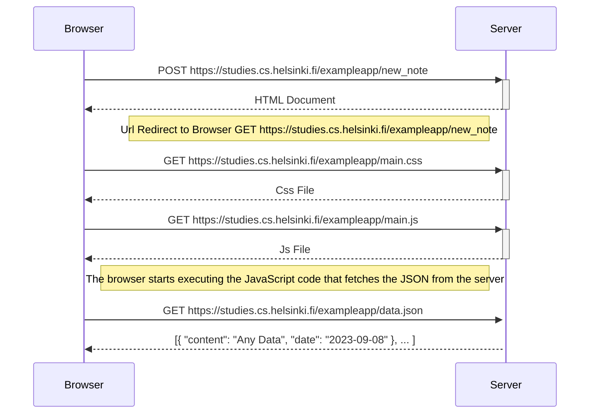

```mermaid
sequenceDiagram
    Browser->>+Server: POST https://studies.cs.helsinki.fi/exampleapp/new_note
    Server-->>-Browser: HTML Document
    Note left of Server: Url Redirect to Browser GET https://studies.cs.helsinki.fi/exampleapp/new_note
    Browser->>+Server: GET https://studies.cs.helsinki.fi/exampleapp/main.css
    Server-->>-Browser: Css File
    Browser->>+Server: GET https://studies.cs.helsinki.fi/exampleapp/main.js
    Server-->>-Browser: Js File
    Note right of Browser: The browser starts executing the JavaScript code that fetches the JSON from the server
    Browser->>+Server: GET https://studies.cs.helsinki.fi/exampleapp/data.json
    Server-->>Browser: [{ "content": "Any Data", "date": "2023-09-08" }, ... ]
```
